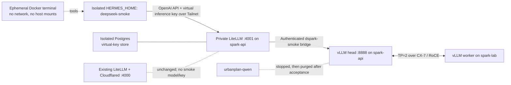

# Dual DGX Spark DeepSeek V4 Flash 0731 Hermes Smoke - Plan

## Goal Capsule

Deploy `deepseek-ai/DeepSeek-V4-Flash-0731` across `spark-api` and `spark-lab`, expose it through a private LiteLLM entrypoint, and prove that an isolated Hermes Agent profile can use it through a fixed smoke suite.

Authority follows this order: the Product Contract defines behavior; the Planning Contract defines implementation; each implementation unit applies those contracts without overriding them. The executor must stop before a mutation when a preflight gate fails. A failed DeepSeek rollout must never reactivate `urbanplan-qwen`.

This is a live-infrastructure implementation with destructive cleanup at the final gate. The executor owns code, node configuration, deployment, evidence, failure cleanup, and the Qwen purge. The operator supplies an interactive `sudo` prompt on each Spark only when the network configuration requires it. No credential may enter Git, command history, logs, or evidence.

## Product Contract

### Summary

Build a reproducible two-node DeepSeek V4 Flash 0731 trial on the two DGX Spark systems. Keep the vLLM origin private to `spark-api`. Put a Tailscale-only LiteLLM instance in front of it. Run Hermes from the Mac mini with a new profile that cannot inherit normal work tools or touch host files. Retire Qwen before DeepSeek serves and remove its artifacts only after the full acceptance report passes.

### Problem Frame

The current environment serves Qwen on one Spark and does not have an IP-layer CX-7 fabric between the two nodes. The upstream DSpark recipe can run the target model on two DGX Spark systems, but its current download path does not enforce the documented Hugging Face revision, its image is referenced by a mutable tag, and its API has no deployment-specific authentication. The active LiteLLM service also shares a process with a public Cloudflare tunnel, so it is not a private-only smoke boundary. The existing Hermes profiles have broad tools, memory, MCP servers, and messaging surfaces that are unsuitable for a controlled model evaluation.

### Actors

- A1. Operator — runs the implementation, supplies local `sudo` interactively, and reviews the sanitized acceptance report.
- A2. Hermes smoke profile — calls one LiteLLM model and performs only the fixed test tasks.
- A3. Existing production gateway — remains running and unchanged while the separate smoke path is evaluated.

### Key Decisions

- Two Spark nodes, not one. (session-settled: user-directed — chosen over a single-Spark trial: the intended evaluation is the recommended two-node DSpark configuration.) Governs R1, R3, and R4.
- A fixed smoke suite comes before real work. (session-settled: user-directed — chosen over starting with finance, Gmail, Linear, Slack, or repository work: the first result must isolate model and infrastructure quality.) Governs R10, R11, and R14.
- Qwen is retired without serving as rollback. (session-settled: user-directed — chosen over restoring `urbanplan-qwen` after a DeepSeek failure: a failure should lead to repair or another replacement.) Governs R5, R12, and R13.
- Hermes stays private on the Mac mini and uses LiteLLM. (session-settled: user-approved — chosen over a public API or direct Hermes-to-vLLM access: one private front door preserves policy and observability.) Governs R7, R8, and R9.

### Requirements

#### Two-node runtime and fabric

- R1. The runtime must serve `deepseek-ai/DeepSeek-V4-Flash-0731` at revision `9e165c30e2704aec5d9d593cce3eebd58bbef1cb` with tensor parallel size 2 across `spark-api` and `spark-lab`.
- R2. Both nodes must use `ghcr.io/anemll/dspark-vllm-gx10@sha256:a83948492cf13df455170fb42885f5ef4db54fefe0feff0f841ecbff464ac9d8` and identical verified model manifests before startup.
- R3. The selected CX-7 link must have persistent point-to-point addressing, equal MTU, no gateway, no DNS, and no default route.
- R4. Startup must be worker-first, and every failed start or stop must leave both DSpark ranks in a verified terminal state.

#### Retirement and coexistence

- R5. `urbanplan-qwen` must be stopped before the DeepSeek runtime starts, must remain stopped after reboots or failures, and must not be called as fallback.
- R6. The existing LiteLLM, Postgres, Cloudflared, backups, keys, and public hostname must remain unchanged during the trial.

#### Private access and Hermes isolation

- R7. The vLLM origin must listen only on a dedicated Docker bridge gateway on `spark-api`, require its own API key, and permit direct diagnostics only through a local or SSH session.
- R8. A separate LiteLLM smoke service must listen only on the `spark-api` Tailscale address, expose one DeepSeek alias, accept a model-scoped inference key, and have no Cloudflared route.
- R9. The Hermes smoke profile must use an independent `HERMES_HOME` and must have no inherited skills, MCP servers, memory, rules, gateway, channels, cron jobs, browser tools, fallback models, host mounts, or forwarded host environment.

#### Acceptance and failure behavior

- R10. The smoke suite must cover authenticated and rejected calls, model discovery, chat, streaming, multi-turn context, reasoning levels, tool calls, invalid models, timeouts, worker loss, and restart recovery.
- R11. Two consecutive complete suite runs must pass with 100% functional cases, zero server errors, and zero writes outside the ephemeral terminal workspace.
- R12. After three discarded warmups, at least 20 measured direct-origin C1 samples must have median decode throughput of at least 50 output tokens per second and p95 time to first token of at most 5 seconds; cold startup and first-request latency must be reported separately.
- R13. Any failed gate must disable the incomplete DeepSeek, LiteLLM smoke, and Hermes smoke layers, preserve sanitized evidence, and leave Qwen stopped.
- R14. The trial must not process real Plexiz or personal data and must not enable Telegram, Slack, Gmail, Linear, finance, PP CLIs, persistent Hermes memory, public API access, or unattended 24/7 startup.
- R15. Qwen artifacts may be purged only after an `accepted: true` report proves R1-R14 and R16-R20 and the operator confirms the fresh run ID and manifest hash; successful revalidation, quarantine, deletion, and absence checks then complete R15, and the purge must retain no Qwen container, image, model cache, service directory, or supervisor entry.
- R16. Evidence must contain timestamps, code and artifact pins, node-safe metadata, test outcomes, and performance aggregates; collectors must allowlist and tokenize fields before persistence and must never persist prompts with real data, credentials, private IP addresses, full environment dumps, or unsanitized logs.
- R17. The smoke LiteLLM and Postgres images must be pinned by digest, run with least privilege, and deny the Hermes inference key access to management endpoints, key creation, configuration, unrelated models, the active gateway database, the Docker socket, and the public internet.
- R18. The measured short workload must use a synthetic prompt of about 256 input tokens with a unique nonce, a fixed 512-token output budget, streaming usage, `temperature=0.6`, and `top_p=0.95`; only complete streams with valid usage and finish semantics count, and decode throughput is `(completion_tokens - 1) / (last_token_time - first_token_time)`.
- R19. Measured requests must disable client and LiteLLM retries and all fallbacks. Each direct request ID must correlate to zero LiteLLM attempts and exactly one vLLM completion; each LiteLLM or Hermes request ID must correlate to exactly one LiteLLM attempt and one vLLM completion. Any retry, fallback, or unmatched origin counter fails acceptance.
- R20. The soak must run a continuous 30-minute closed-loop C1 workload through LiteLLM, alternate unique short and approximately 2,000-token synthetic prompts with fixed 256-token outputs, sample both nodes every 5 seconds, and meet the R12 throughput threshold with zero timeout, 5xx, OOM, GPU fault, restart, or preemption; minimum observed `MemAvailable` must remain at least 8 GiB per node and queue depth must return to zero between requests and never exceed 1.

### Flows

- F1. Trial path — preflight the nodes and active services; configure and verify the fabric; prepare identical pinned artifacts; record and stop Qwen; start the worker and head; pass direct vLLM tests; start private LiteLLM; create the empty Hermes profile; run acceptance twice and soak once; record acceptance; purge Qwen.
- F2. Failure path — stop the current layer and every dependent smoke layer; verify both DSpark ranks are down when runtime health is uncertain; retain sanitized evidence; repair the failed layer; restart from its preflight gate without starting Qwen.

### Acceptance Examples

- AE1. Covers R3 and R5 — when netplan validation or the direct-link test fails, the run stops before Qwen is stopped.
- AE2. Covers R7 and R8 — the vLLM key fails outside the dedicated bridge, the LiteLLM inference key succeeds over Tailscale, and the same key cannot reach a public hostname because no public route exists for the smoke service.
- AE3. Covers R9 and R11 — when the Hermes task tries to read `~/.ssh`, `~/.hermes`, or a real repository, the sandbox cannot see those paths and the test records a pass.
- AE4. Covers R10 and R13 — when `spark-lab` is stopped during a controlled request, the request fails within its timeout, both DSpark ranks are cleaned up, and Qwen remains stopped.
- AE5. Covers R15 — when all acceptance gates pass twice, the report says `accepted: true`, and the operator confirms its run ID and manifest hash, cleanup quarantines and removes only revalidated Qwen targets and verifies each target is absent.

### Success Criteria

- All requirements map to executable tests and evidence fields.
- The direct, LiteLLM, and Hermes layers each pass independently before the next layer starts.
- R11, R12, and R17-R20 pass with measured results, not inferred health.
- The final state contains the validated DeepSeek trial path and no Qwen serving artifacts.

### Scope Boundaries

Now:

- Two DGX Spark runtime, persistent direct fabric, private LiteLLM smoke entrypoint, isolated Hermes profile, fixed tests, evidence, and Qwen retirement.

Later:

- Model comparison against other replacements if DeepSeek fails acceptance.
- A supervised always-on service, normal Hermes profile promotion, Telegram/Desktop use, and real personal or Plexiz specialists.
- Long-context and concurrency optimization beyond the acceptance workload.

Never during this trial:

- Reusing the `default` or `hermesia` Hermes profile.
- Sending real email, finance, Slack, Linear, client, personal, or repository data to the model.
- Publishing the smoke endpoint or its key through Cloudflare.

### Dependencies

- Passwordless SSH from the control host to `spark-api` and from `spark-api` to `spark-lab`.
- One interactive `sudo` authorization per Spark for the root-owned netplan change.
- Registry and Hugging Face access during artifact preparation; serving runs offline after the cache gate passes.
- Docker on both Spark nodes and a functioning Docker-compatible Colima profile on the Mac mini.

## Planning Contract

### Key Technical Decisions

- KTD1. Keep upstream runtime improvements generic and place deployment-specific templates under `deployments/private-smoke/`. Work on a local `codex/` branch and do not push to the public `origin`; a later push requires a private remote. This implements R1-R16 without publishing internal deployment details.
- KTD2. Use `enp1s0f0np0` with HCA `rocep1s0f0` on both Sparks, addresses `10.77.77.1/30` and `10.77.77.2/30`, and MTU 9000. Merge this stanza into the existing root-owned netplan configuration after a backup, and preserve the renderer already selected on each host. This implements R3.
- KTD3. Add an explicit Hugging Face revision to download, offline verification, and vLLM startup. Pin the OCI image by digest and compare SHA-256 manifests of the resolved snapshot on both nodes before Qwen stops. This implements R1 and R2.
- KTD4. Create a dedicated Docker bridge named `dspark-smoke` after verifying that `172.30.0.0/24` does not collide with a current route. Bind vLLM to its host gateway at `172.30.0.1:8888`. Generate separate head and worker environment files from allowlists. Read the head API key from a mode-0600 secret without placing it in Compose rendering, process arguments, logs, Docker inspect output, or any worker file. Run direct tests through SSH on the head. This implements R7.
- KTD5. Run isolated LiteLLM and Postgres containers on `dspark-smoke`, publish only `${HEAD_TAILSCALE_IP}:4001`, and route the sole alias to the bridge origin. Pin `ghcr.io/berriai/litellm-database@sha256:5fa5f99cd5576e359a0e50395ad14edbe922ef41c152f67c534e4f8b6238c5ec` and `postgres@sha256:b797483593b82cbea9a7ee41c88f324a90d10d9c2504d40e755d91c75456366d`. Keep the bootstrap master key operator-only and give Hermes a virtual key restricted to inference on `deepseek-v4-flash-0731-smoke`. Run the containers as non-root with dropped capabilities, read-only root filesystems, `no-new-privileges`, explicit seccomp, tmpfs write locations, no Docker socket, and no general egress. (session-settled: user-approved — chosen over Hermes calling vLLM directly: LiteLLM remains the private front door; the separate listener prevents the existing Cloudflared process from sharing this model or key.) This implements R6, R8, and R17.
- KTD6. Record the Qwen container, restart policy, compose project, service directory, image digest, model cache, secrets, supervisors, canonical paths, file types, ownership, device, inode, and symlink state before using `docker compose stop qwen`. After R15 passes, require an interactive confirmation containing the fresh run ID and manifest hash. Revalidate each target, atomically rename filesystem targets into a same-filesystem quarantine, and remove only the quarantine and exact container/image IDs. Never use a recursive glob or `down -v`. (session-settled: user-directed — chosen over a Qwen rollback: failure cleanup removes only the incomplete DeepSeek path.) This implements R5, R13, and R15.
- KTD7. Create a private mode-0700 `HERMES_HOME` outside the existing Hermes root for each acceptance run. Seed only the `deepseek-smoke` custom provider and virtual inference key, and set no fallback. Invoke Hermes with that environment path directly instead of changing the global active profile. This implements R8 and R9.
- KTD8. Run the Hermes terminal backend against a dedicated Colima Docker profile through an invocation-local `DOCKER_HOST`. Set `container_persistent: false`, `docker_persist_across_processes: false`, `docker_volumes: []`, `docker_mount_cwd_to_workspace: false`, `docker_forward_env: []`, and `docker_network: false`. The model call runs on the Mac mini host; terminal tasks run in ephemeral tmpfs. This implements R9 and R11.
- KTD9. Build evidence from schema-allowlisted fields and tokenize host, interface, and address identities before writing them. Compare raw tool output in memory or through stdin against actual secret values and deterministic canaries, and write only schema-valid allowlisted records. Cleanup traps may cover already-sanitized temporary outputs, and acceptance must fail if any raw artifact is ever persisted. Persist only sanitized JSON events and a Markdown summary under ignored `artifacts/acceptance/<UTC timestamp>/`. This implements R11, R12, and R16.
- KTD10. Do not install a system service, LaunchAgent, Telegram gateway, or restart policy for DeepSeek or the smoke LiteLLM instance in this plan. This implements R14.
- KTD11. Establish runtime viability at the direct vLLM origin before U6. Re-run the same request set through LiteLLM and Hermes to report layer overhead without changing the direct acceptance baseline. Correlate request IDs and origin counters, and record KV-cache utilization and speculative acceptance as diagnostics rather than pass thresholds. This implements R12 and R18-R20.

### High-Level Technical Design

```mermaid
stateDiagram-v2
    [*] --> Preflight
    Preflight --> FabricReady: network gates pass
    Preflight --> Stopped: gate fails
    FabricReady --> ArtifactsReady: image and model manifests match
    ArtifactsReady --> QwenRetired: Qwen manifest recorded and service stopped
    QwenRetired --> DirectPassed: DSpark and direct API pass
    DirectPassed --> GatewayPassed: private LiteLLM passes
    GatewayPassed --> HermesPassed: two fixed suites pass
    HermesPassed --> Accepted: performance and soak pass
    HermesPassed --> Diagnose: performance or soak gate fails
    Accepted --> QwenPurged: accepted report exists
    QwenRetired --> Diagnose: any later gate fails
    DirectPassed --> Diagnose: any later gate fails
    GatewayPassed --> Diagnose: any later gate fails
    Diagnose --> Stopped: DeepSeek smoke layers cleaned up; Qwen stays stopped
    Stopped --> Preflight: after repair
```





### System-Wide Impact

- Network — adds one isolated `/30` route on each Spark and no default route.
- Compute — replaces a one-node Qwen workload with a two-node DeepSeek workload during the test.
- Authentication — adds an origin key, an operator-only LiteLLM master key, and a model-scoped Hermes inference key.
- Hermes — adds an isolated `HERMES_HOME` and Colima context without modifying `default`, `hermesia`, their LaunchAgents, or their state.
- Data lifecycle — holds Qwen artifacts until acceptance, then removes the recorded targets as an intentional destructive tail.
- Public service — leaves the current port 4000 gateway, database, backups, and Cloudflare tunnel unchanged.

### Sequencing Constraints

1. Complete U1-U3 while Qwen is still serving.
2. Stop Qwen only after the fabric and artifact preflight pass.
3. Pass direct vLLM before starting private LiteLLM.
4. Pass the direct C1 performance gate before starting private LiteLLM.
5. Pass private LiteLLM before creating or invoking Hermes.
6. Purge Qwen only after the final accepted report is present and sanitized.

### Risks and Mitigations

- Existing `/etc/netplan/40-cx7.yaml` is unreadable without `sudo`. U2 must inspect and back it up before generating a merged file; it must not overwrite an unknown configuration.
- The upstream stop and status scripts currently mask some failures with `|| true`. U3 makes cleanup idempotent but verifies terminal state and returns non-zero when either rank remains unhealthy.
- The published image tag and model helper are mutable without extra pins. U1 and U3 convert both to immutable identities.
- vLLM uses host networking for distributed execution. KTD4 binds the origin to a dedicated bridge gateway and restricts the bridge instead of exposing it on LAN or Tailnet.
- LiteLLM holds two sensitive credentials and accepts remote Tailnet traffic. KTD5 separates administration from inference, pins its supply chain, and confines its process and network.
- The Mac mini already runs Hermes services. KTD7 and KTD8 use an independent `HERMES_HOME` and a dedicated Docker daemon context to avoid state leakage.
- Acceptance artifacts are locally writable. KTD6 binds purge authorization to a fresh hash chain and revalidates filesystem identity immediately before quarantine.
- The model advertises a 1,048,576-token context. This plan does not make a full-context benchmark an acceptance gate; long-context performance remains later work.
- Published 0731 captures vary after warmup and JIT. KTD11 separates cold latency, discarded warmups, direct viability, and layer overhead, and R12 requires a sample count that supports p95.

## Implementation Units

### U1. Add immutable artifact and secret contracts

Goal: make every runtime artifact, node-specific environment, and API credential explicit before any node mutation.

Requirements: R1, R2, R7, R16, and R17.

Files:

- `.env.dspark.example`
- `docker-compose.dspark.yml`
- `prepare-dspark-model-cache.sh`
- `validate-dspark-config.sh`
- `scripts/verify-artifact-manifest.py`
- `tests/test_artifact_contract.py`

Dependencies: none.

Approach:

- Add `DSPARK_MODEL_REVISION`, an OCI digest reference, and a head-only API secret file input.
- Generate head and worker environment files from separate allowlists, and copy only the generated worker file to `spark-lab`.
- Pass the revision to `snapshot_download`, offline cache resolution, and `vllm serve --revision`.
- Generate a deterministic manifest from the snapshot commit, expected safetensor filenames, sizes, and SHA-256 hashes.
- Require equal manifests on both nodes and reject a tag-only image reference.
- Keep secret values out of Compose rendering and test output.

Test scenarios:

- A missing revision, digest, or secret file fails validation.
- A different shard hash or image digest on the worker fails before startup.
- Offline verification does not call Hugging Face.
- Rendered diagnostics redact the API key.
- Worker files, container metadata, process metadata, and evidence contain neither the key, its hash, nor its canary.

Verification:

- `python3 -m unittest tests.test_artifact_contract`
- `bash -n prepare-dspark-model-cache.sh validate-dspark-config.sh`
- `docker compose --env-file .env.dspark.example -f docker-compose.dspark.yml config --quiet`

### U2. Configure and verify the persistent CX-7 fabric

Goal: create the point-to-point network required by R3 without changing either node's normal route.

Requirements: R3, R4, and R13.

Files:

- `deployments/private-smoke/network/head-cx7.yaml`
- `deployments/private-smoke/network/worker-cx7.yaml`
- `deployments/private-smoke/scripts/apply-cx7-network.sh`
- `deployments/private-smoke/scripts/verify-fabric.sh`
- `tests/test_network_templates.py`

Dependencies: U1.

Approach:

- Render KTD2 as a minimal netplan stanza with `optional`, `never-default`, no nameservers, and no gateway.
- In check mode, inspect all current netplan files through interactive `sudo`, confirm no address or route collision, and show the exact merged diff.
- Back up each affected root-owned file with a UTC suffix.
- Apply one node at a time with a timed rollback path, then verify Wi-Fi, Tailscale, default route, the `/30`, MTU, HCA state, GID selection, and peer identity.
- Run large-frame ping, `ib_write_bw` in both directions, and `nccl-tests all_reduce_perf` before recording `fabric-ready.json`.

Test scenarios:

- A route collision, wrong interface, missing peer, unequal MTU, or failed RDMA test blocks apply or rolls back.
- Restarting the active network renderer restores both CX-7 addresses without changing the default route.
- An intentionally wrong GID fails the readiness check.

Verification:

- `python3 -m unittest tests.test_network_templates`
- `deployments/private-smoke/scripts/apply-cx7-network.sh --check`
- `deployments/private-smoke/scripts/apply-cx7-network.sh --apply`
- `deployments/private-smoke/scripts/verify-fabric.sh --require-persistent`

### U3. Harden two-rank lifecycle and direct API tests

Goal: make DSpark startup, health, stop, and failure cleanup fail closed.

Requirements: R1, R4, R7, R10, and R13.

Files:

- `start-deepseek-v4-flash-dspark.sh`
- `stop-deepseek-v4-flash-dspark.sh`
- `status-deepseek-v4-flash-dspark.sh`
- `smoke-deepseek-v4-flash-dspark.sh`
- `scripts/smoke-openai-compat.py`
- `tests/test_lifecycle_contract.py`

Dependencies: U1 and U2.

Approach:

- Preserve worker-first startup and add a trap that stops and verifies both ranks after any start failure.
- Make status return non-zero unless both ranks and the authenticated head endpoint match the pinned model.
- Make stop idempotent but non-zero when either rank remains.
- Wire the head secret through the non-rendered runtime path from KTD4 and keep the worker secret-free.
- Replace response-discard and `choices`-only checks with schema and semantic assertions for the direct cases in R10.
- Bind the head according to KTD4 and prove unauthenticated requests fail.

Test scenarios:

- Wrong GID, missing worker image, mismatched model manifest, port conflict, and head timeout leave no partial ranks.
- Killing the worker causes a bounded request failure and verified two-rank cleanup.
- Missing or wrong API key fails; valid key passes `/v1/models`, chat, stream, reasoning, and tool calls.
- The origin refuses LAN, Tailnet, unrelated Docker bridges, and containers outside `dspark-smoke`.
- Stop succeeds when already stopped and fails if a test double leaves one rank alive.

Verification:

- `python3 -m unittest tests.test_lifecycle_contract`
- `bash -n start-deepseek-v4-flash-dspark.sh stop-deepseek-v4-flash-dspark.sh status-deepseek-v4-flash-dspark.sh smoke-deepseek-v4-flash-dspark.sh`
- `./status-deepseek-v4-flash-dspark.sh --expect stopped`

### U4. Record and retire the Qwen service

Goal: stop Qwen only after its exact state is recorded and all pre-Qwen gates pass.

Requirements: R5, R6, R13, R15, and R16.

Files:

- `deployments/private-smoke/scripts/inventory-qwen.sh`
- `deployments/private-smoke/scripts/stop-qwen.sh`
- `deployments/private-smoke/scripts/purge-qwen.sh`
- `deployments/private-smoke/schemas/qwen-manifest.schema.json`
- `tests/test_qwen_lifecycle.py`

Dependencies: U1-U3; U2 and the artifact preflight must have live passing evidence.

Approach:

- Read only metadata for the service, container, image, cache, secrets, restart policy, supervisors, listeners, and the last 30 days of LiteLLM success counts.
- Write a sanitized explicit manifest with stable target IDs and paths.
- Stop the Compose service, wait through the restart policy window, and verify port 8000, the container state, and supervisors.
- Refuse to purge without the manifest, its current hash, a fresh `accepted: true` report, and the operator confirmation from KTD6.
- Revalidate canonical containment, ownership, type, device, inode, and symlink state immediately before quarantine.
- Quarantine exact filesystem targets before deletion and prove absence; never touch the active gateway's files, secrets, database, or backups.

Test scenarios:

- Missing or stale manifest blocks stop and purge.
- A restarted Qwen container fails the stop gate.
- A purge target outside the recorded service and cache roots is rejected.
- A report without `accepted: true` cannot authorize purge.
- A replaced inode, symlink, stale run ID, changed manifest hash, or non-interactive invocation blocks purge.

Verification:

- `python3 -m unittest tests.test_qwen_lifecycle`
- `deployments/private-smoke/scripts/inventory-qwen.sh --check-only`
- `deployments/private-smoke/scripts/stop-qwen.sh --verify-only`

### U5. Deploy the pinned DSpark runtime and pass the direct gate

Goal: start the exact two-node runtime and prove the bridge-only origin before adding a gateway.

Requirements: R1-R5, R7, R10, R12, R13, R16, R18, and R19.

Files:

- `deployments/private-smoke/.env.example`
- `deployments/private-smoke/scripts/preflight.sh`
- `deployments/private-smoke/scripts/deploy-dspark.sh`
- `deployments/private-smoke/scripts/collect-node-evidence.sh`
- `deployments/private-smoke/scripts/benchmark.py`
- `deployments/private-smoke/schemas/node-evidence.schema.json`

Dependencies: U1-U4.

Approach:

- Create mode-0600 untracked environment and secret files from templates.
- Pull the image by digest and download the model by revision on both nodes while Qwen still runs.
- Re-run fabric, disk, memory, image, snapshot, Docker, SSH, listener, and secret checks.
- Stop Qwen through U4, enable offline serving, and start DSpark through U3.
- Run the full direct API gate and collect redacted node evidence.
- Discard three warmups, then run the direct-origin workload from R18 for at least 20 measured C1 samples.
- Snapshot vLLM counters before and after the benchmark and enforce the request correlation from R19.

Test scenarios:

- Any missing pin, secret permission, cache item, listener, or preflight evidence blocks launch.
- Direct API is unreachable from LAN, Tailnet, and unrelated Docker networks but succeeds through local SSH with the key.
- A failed direct gate invokes F2 and leaves Qwen stopped.
- A cold first request is reported but does not enter the warmed distribution.
- A retry, incomplete stream, invalid usage block, wrong finish reason, or unmatched request ID fails the direct performance gate.

Verification:

- `deployments/private-smoke/scripts/preflight.sh --all`
- `deployments/private-smoke/scripts/deploy-dspark.sh --direct-gate`
- `python3 scripts/smoke-openai-compat.py --profile direct --runs 2`
- `python3 deployments/private-smoke/scripts/benchmark.py --layer direct --warmups 3 --samples 20 --concurrency 1`

### U6. Add the private LiteLLM smoke front door

Goal: expose one authenticated DeepSeek alias over Tailscale without changing the active gateway.

Requirements: R6-R8, R10, R13, R16-R19.

Files:

- `deployments/private-smoke/litellm/docker-compose.yml`
- `deployments/private-smoke/litellm/config.yaml`
- `deployments/private-smoke/litellm/secret-entrypoint.sh`
- `deployments/private-smoke/litellm/bootstrap-virtual-key.sh`
- `deployments/private-smoke/litellm/seccomp.json`
- `deployments/private-smoke/litellm/smoke.sh`
- `tests/test_private_gateway.py`

Dependencies: U5 direct gate.

Approach:

- Run the isolated one-model LiteLLM and Postgres instances defined by KTD5 without joining the active gateway's Docker network.
- Load the operator master, virtual inference, Postgres, and origin keys from mode-0600 files and redact them from Compose output and logs.
- Bootstrap a model-scoped virtual key, then prove the Hermes credential cannot use admin or key-management endpoints.
- Enforce the container identity, filesystem, capability, seccomp, mount, and egress controls from R17.
- Set LiteLLM retries and fallbacks to zero and propagate the client request ID into its safe logs.
- Test the allowed Tailscale socket, all other host interfaces, wrong keys, wrong models, and the untouched public gateway catalog.
- Stop and remove this container on any gate failure.

Test scenarios:

- The dedicated key can call only `deepseek-v4-flash-0731-smoke`.
- The dedicated key cannot create keys, inspect configuration, call management endpoints, or use the operator master credential.
- Port 4001 is not reachable through LAN, localhost from a remote peer, or the public hostname.
- Port 4000 catalog and existing containers do not change before and after deployment.
- An unavailable origin produces a bounded error and no fallback model.
- One gateway request produces exactly one LiteLLM attempt and one vLLM completion.
- LiteLLM cannot reach the public internet, active gateway database, Docker socket, or unrelated host listeners.

Verification:

- `python3 -m unittest tests.test_private_gateway`
- `docker compose -f deployments/private-smoke/litellm/docker-compose.yml config --quiet`
- `deployments/private-smoke/litellm/smoke.sh --all-interfaces`

### U7. Create the isolated Hermes profile and suite

Goal: prove Hermes can use the private model from an independent home without inheriting operational capabilities.

Requirements: R8-R11, R13, R14, and R16.

Files:

- `deployments/private-smoke/hermes/config.yaml`
- `deployments/private-smoke/hermes/create-profile.sh`
- `deployments/private-smoke/hermes/run-suite.sh`
- `deployments/private-smoke/hermes/fixtures/transform-input.json`
- `deployments/private-smoke/hermes/fixtures/tool-contract.json`
- `deployments/private-smoke/schemas/hermes-result.schema.json`
- `tests/test_hermes_isolation.py`

Dependencies: U6.

Approach:

- Create the independent `HERMES_HOME` according to KTD7 and write its virtual key only to its mode-0600 `.env`.
- Start a dedicated Colima Docker profile and pass its socket only to the suite process.
- Apply KTD8 and inspect the resolved Hermes profile before invocation.
- Use `hermes -z` with `--usage-file`, the one custom provider, the fixed model, and only the terminal toolset.
- Use the model card's agentic sampling profile separately from the R18 performance workload.
- Run deterministic tasks that create, read, and transform synthetic fixtures inside the ephemeral workspace.
- Add negative tasks that attempt to discover skills, MCPs, memory, gateways, host paths, network, and fallback providers.

Test scenarios:

- The profile inventory has zero inherited integrations and exactly one inference model.
- Host paths and network are invisible from the terminal sandbox.
- Tool calls stay inside tmpfs and disappear after process cleanup.
- Invalid model, LiteLLM timeout, and malformed response produce explicit failure without fallback.
- Existing `default` and `hermesia` roots, active-profile pointers, symlinks, permissions, registries, secrets, configs, and LaunchAgents have identical metadata and content hashes before and after the suite.
- The installed Hermes version is rejected if it touches shared global state while using the independent `HERMES_HOME`.

Verification:

- `python3 -m unittest tests.test_hermes_isolation`
- `deployments/private-smoke/hermes/create-profile.sh --verify-only`
- `deployments/private-smoke/hermes/run-suite.sh --repeat 2`

### U8. Automate acceptance, soak, sanitization, and Qwen purge

Goal: turn all layer gates into one auditable acceptance decision and finish the destructive tail.

Requirements: R10-R20.

Files:

- `deployments/private-smoke/run-acceptance.sh`
- `deployments/private-smoke/scripts/sanitize-evidence.py`
- `deployments/private-smoke/schemas/acceptance.schema.json`
- `deployments/private-smoke/fixtures/suite.json`
- `docs/runbooks/private-dual-spark-smoke.md`
- `tests/test_acceptance_report.py`

Dependencies: U1-U7.

Approach:

- Orchestrate F1 and F2 with machine-readable gate states and bounded timeouts.
- Re-run the R18 request set through LiteLLM and Hermes, correlate R19, and report each layer's overhead against the direct baseline.
- Run the R20 soak through LiteLLM while sampling both nodes every 5 seconds; retain only sanitized aggregates and diagnostic KV/speculation series.
- Validate and sanitize raw tool output in memory or through stdin, then write only schema-valid allowlisted evidence before setting `accepted`.
- Require two complete functional runs and one soak from the same code, image, model, and config pins.
- When accepted, pause for the run-ID and manifest-hash confirmation, then invoke the quarantine-and-purge path from U4 and re-run absence and active-gateway checks.
- Keep DeepSeek and private LiteLLM manually started for inspection, but install no automatic restart behavior.

Test scenarios:

- A functional, performance, isolation, sanitization, or soak failure produces `accepted: false` and executes F2.
- A pin change between the two runs invalidates the acceptance set.
- A planted credential or private IP makes sanitization fail.
- An idle interval, retry, unmatched request, queue-depth breach, transient memory breach, preemption, or restart fails the soak.
- Successful acceptance purges Qwen and leaves the existing public gateway unchanged.

Verification:

- `python3 -m unittest tests.test_acceptance_report`
- `deployments/private-smoke/run-acceptance.sh --validate-fixtures`
- `deployments/private-smoke/run-acceptance.sh --live`
- `deployments/private-smoke/scripts/purge-qwen.sh --verify-only`

## Verification Contract

### Static and local gates

Run from the repository root:

```bash
python3 -m unittest discover -s tests -p 'test_*.py'
bash -n ./*.sh deployments/private-smoke/scripts/*.sh deployments/private-smoke/litellm/*.sh deployments/private-smoke/hermes/*.sh
shellcheck ./*.sh deployments/private-smoke/scripts/*.sh deployments/private-smoke/litellm/*.sh deployments/private-smoke/hermes/*.sh
docker compose --env-file .env.dspark.example -f docker-compose.dspark.yml config --quiet
docker compose -f deployments/private-smoke/litellm/docker-compose.yml config --quiet
```

### Live gate order

1. `deployments/private-smoke/scripts/apply-cx7-network.sh --check`
2. `deployments/private-smoke/scripts/apply-cx7-network.sh --apply`
3. `deployments/private-smoke/scripts/verify-fabric.sh --require-persistent`
4. `deployments/private-smoke/scripts/preflight.sh --all`
5. `deployments/private-smoke/scripts/inventory-qwen.sh --write-manifest`
6. `deployments/private-smoke/scripts/stop-qwen.sh`
7. `deployments/private-smoke/scripts/deploy-dspark.sh --direct-gate`
8. `python3 deployments/private-smoke/scripts/benchmark.py --layer direct --warmups 3 --samples 20 --concurrency 1`
9. `deployments/private-smoke/litellm/smoke.sh --all-interfaces`
10. `deployments/private-smoke/hermes/run-suite.sh --repeat 2`
11. `deployments/private-smoke/run-acceptance.sh --live`
12. `deployments/private-smoke/scripts/purge-qwen.sh`

Each command must consume the prior command's hash-chained gate JSON. It must reject stale evidence, a broken hash chain, or different artifact pins.

### Requirement traceability

| Requirements | Proved by |
|---|---|
| R1-R4 | artifact unit tests, persistent fabric tests, equal manifests, two-rank lifecycle, direct model identity |
| R5-R6 | Qwen manifest and stopped-state checks, before/after hashes for the active gateway |
| R7-R8 | interface matrix, negative auth, direct bridge test, one-model LiteLLM catalog |
| R9 | isolated-home inventory, Docker confinement tests, shared-state metadata and hash comparison |
| R10-R11 | two complete fixed-suite reports and controlled failure cases |
| R12 | streaming benchmark JSON, 30-minute soak, node memory and restart evidence |
| R13 | injected gate failures and verified terminal states |
| R14 | absence checks for messaging, integrations, public exposure, and supervisors |
| R15 | accepted report reference, exact-target purge log, post-purge absence checks |
| R16 | schema validation and secret/address/path sanitizer |
| R17 | image digest checks, virtual-key authorization matrix, container confinement, and egress denials |
| R18 | versioned synthetic workload fixture, streaming timing fields, and decode formula assertion |
| R19 | zero-retry configuration, client/LiteLLM/vLLM request correlation, and origin counter deltas |
| R20 | continuous C1 soak log, 5-second node samples, queue and memory minima, and fault/preemption absence |

### Release gate

There is no production release in this plan. The acceptance report is the release-equivalent gate for the trial. A report is valid only when collectors sanitize before persistence, its schema passes, `accepted: true`, all input pins match, and the final canary scan finds no raw artifact.

## Definition of Done

Global completion requires:

- Every R-ID has passing evidence from the commands in the Verification Contract.
- The two Spark nodes serve the pinned model through TP=2 and the selected CX-7 fabric.
- The vLLM origin is bridge-only and the LiteLLM smoke entrypoint is Tailscale-only.
- The isolated Hermes profile completes two consecutive suites and cannot access host or external work surfaces.
- R12 passes with recorded measurements.
- The direct benchmark passes before gateway or Hermes work, and later measurements report overhead without replacing that baseline.
- Every measured request has one client ID, one LiteLLM attempt when applicable, one vLLM completion, and no retry or fallback.
- The accepted report is sanitized and references immutable code, image, model, and configuration pins.
- Qwen targets in the confirmed manifest are revalidated, quarantined, removed, and not re-created by a supervisor.
- The active LiteLLM/Postgres/Cloudflared deployment and its backups remain unchanged and healthy.
- No discarded experiment, dead code, plaintext secret, raw response dump, or unsanitized artifact remains in the Git diff.
- The runbook covers startup, status, stop, evidence, failure cleanup, and the fact that Qwen is not a rollback.

Per-unit completion requires each unit's files, scenarios, and verification commands to pass before a dependent unit begins. U8 is complete only after the destructive Qwen tail and its absence checks finish.

## Appendix

### Verified baseline on 2026-08-02

- `spark-api` resolves to DGX Spark host `spark-5f50`; `spark-lab` resolves to `spark-c907`.
- Both nodes run NVIDIA kernel `6.17.0-1026-nvidia`, driver `580.159.03`, and an NVIDIA GB10 with about 121 GiB unified memory.
- Both nodes expose active 200 Gb/s `enp1s0f0np0` / `rocep1s0f0` links without IPv4 addresses.
- Both nodes have an existing root-owned `/etc/netplan/40-cx7.yaml`; its content requires interactive `sudo` to inspect.
- `urbanplan-qwen` is healthy on `spark-api` with restart policy `unless-stopped`. LiteLLM recorded 51 successful Qwen requests in the last 30 days, the last at 2026-07-20 05:47:06 UTC, and zero successful Qwen requests in the last 7 days.
- The active LiteLLM binds to the Tailscale address on port 4000 and shares a Docker network with Cloudflared. Its Postgres backups are current through 2026-08-02.
- Neither Spark has the target Hugging Face snapshot cached.
- Hermes Agent v0.19.0 supports custom `HERMES_HOME` roots, custom providers, one-shot usage reports, and the Docker terminal backend. The Mac mini Docker client and current Colima Docker daemon pass `docker version`.
- Existing Hermes services and the dirty Hermes source change are outside this plan and must remain untouched.

### Source anchors

- Upstream runtime and current 0731 recipe: `README.md`, `.env.dspark.example`, `docker-compose.dspark.yml`, `start-deepseek-v4-flash-dspark.sh`, and `docs/DEEPSEEK_V4_FLASH_0731.md` at commit `b131b2a22164675890dd1465fd8862b5cfb6ff13`.
- Upstream lifecycle gaps: `prepare-dspark-model-cache.sh:53`, `start-deepseek-v4-flash-dspark.sh:487`, `start-deepseek-v4-flash-dspark.sh:499`, `stop-deepseek-v4-flash-dspark.sh:34`, `status-deepseek-v4-flash-dspark.sh:25`, and `smoke-deepseek-v4-flash-dspark.sh:20`.
- Model behavior and licensing: [DeepSeek V4 Flash 0731 model card](https://huggingface.co/deepseek-ai/DeepSeek-V4-Flash-0731).
- Direct-link setup: [NVIDIA DGX Spark clustering guide](https://docs.nvidia.com/dgx/dgx-spark/spark-clustering.html).
- Hermes custom OpenAI-compatible provider: [Hermes Agent provider documentation](https://github.com/NousResearch/hermes-agent/blob/main/website/docs/integrations/providers.md).
- vLLM request correlation and performance fields: [vLLM per-request metrics](https://docs.vllm.ai/en/latest/features/per_request_metrics/) and [vLLM metrics design](https://docs.vllm.ai/en/stable/design/metrics/).
