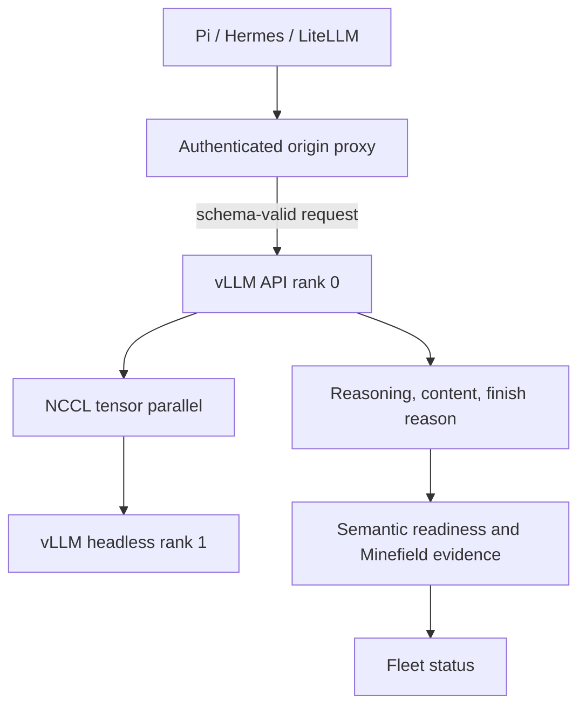
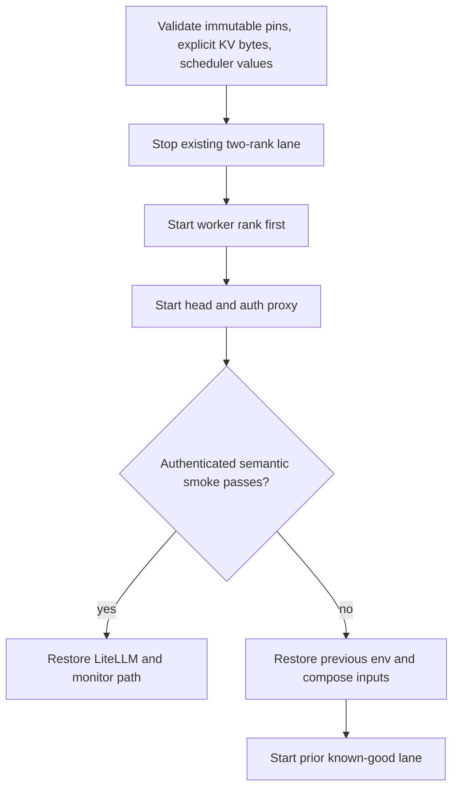

# DeepSeek Stack Health Hardening - Plan

## Goal Capsule

- **Objective:** Make the pinned DeepSeek V4 Flash 0731 two-DGX-Spark lane truthful, memory-deterministic, and operationally verifiable after the Model Serving Minefield audit.
- **Authority:** Preserve the official model revision, pinned runtime image, authenticated private-origin topology, and existing dual-rail work already present on the branch.
- **Execution profile:** Characterize the current request/render behavior first, then change configuration and gates, then perform one controlled two-rank restart with rollback evidence.
- **Stop conditions:** Stop before restart if the rendered compose no longer pins the model/image, the explicit KV budget cannot sustain the 1,048,576-token lane, or a direct authenticated smoke cannot prove both ranks participate.
- **Tail ownership:** The implementation owns tests, documentation, production rollout, post-restart Minefield evidence, and restoration of the externally reachable authenticated LiteLLM gateway.

---

## Product Contract

### Summary

The serving lane is available, but several controls are misleading. The current off mapping uses a parameter that the pinned tokenizer accepts without disabling reasoning, historical reasoning is dropped unless the Python encoder receives its real preservation kwarg, and a fractional memory reservation governs a unified-memory host. Health monitoring also proves transport or authentication rather than a complete generation through both ranks.

This work makes those contracts explicit and testable without changing the official model revision or the pinned container digest.

### Problem Frame

The 2026-08-09 audit observed a healthy two-rank process with zero error finishes and strong prefix reuse, but request acceptance was wider than effective behavior. `chat_template_kwargs.thinking=false` did not disable reasoning, while `reasoning_effort=none` did. The live Python encoder defaults `drop_thinking=true`; a render probe proved that `drop_thinking=false` preserves both `reasoning` and `reasoning_content` history markers. A hard request at 512 output tokens returned `finish_reason=length`, populated reasoning, and empty final content. Both GB10 hosts used more than 112 GiB of 121 GiB unified memory under `--gpu-memory-utilization 0.80`.

### Requirements

**Reasoning and request behavior**

- R1. Every advertised thinking mode must map to a parameter shape whose effect is asserted against the live response or rendered prompt.
- R2. The off mode must use `reasoning_effort=none`; `thinking=false` alone must not be presented as an effective off switch.
- R3. Multi-turn agent requests must preserve prior assistant reasoning with the pinned DeepSeek V4 Python encoder.
- R4. The authenticated origin must reject unsupported top-level chat-completion fields instead of forwarding an apparently successful typo to vLLM.
- R5. A completion that ends with `finish_reason=length` and empty content must be classified as budget truncation, not model failure, and the shipped smoke tooling must expose that classification.

**Memory and scheduler behavior**

- R6. The default production GB10 profile must size KV cache with an explicit per-rank byte budget; the unified-memory utilization fraction is permitted only as the explicit compatibility/rollback fallback in KTD5 and must never be rendered together with the byte control.
- R7. Configuration validation must reject invalid or conflicting memory controls before either rank starts.
- R8. Scheduler and CUDA-graph defaults must match the effective values accepted by the pinned vLLM build without startup truncation or avoidable speculative-token warnings.

**Readiness and operations**

- R9. Readiness must include an authenticated, bounded generation that traverses the head API and both tensor-parallel ranks.
- R10. The semantic smoke must verify model discovery, thinking off/on, multi-turn reasoning preservation, streaming, structured tool calls, unsupported-field rejection, and cap-hit classification.
- R11. Rollout must preserve the current dual-rail automatic GID selection, persistent private-gateway database changes, immutable image/model pins, and rollback inputs already present on the branch.
- R12. Post-rollout evidence must distinguish healthy process state, authenticated API readiness, model behavior, memory headroom, prefix-cache engagement, and Minefield coverage.
- R13. Speculative-decode health must calculate acceptance from accepted draft tokens divided by proposed draft tokens instead of averaging raw cumulative counters.

### Acceptance Examples

- AE1. Given an off request, when the lane renders and completes it, then no reasoning channel fires and final content is present.
- AE2. Given a prior assistant turn containing a unique reasoning marker, when a later turn is rendered with the supported preservation setting, then the marker appears inside balanced thinking boundaries.
- AE3. Given an invented top-level request field, when the request crosses the authenticated proxy, then it receives a 400-class validation response and never reaches vLLM.
- AE4. Given a low output ceiling that exhausts during reasoning, when smoke evaluates the response, then it reports truncation and does not label the model unavailable.
- AE5. Given the explicit KV budget, when both ranks start, then the lane retains at least one full advertised-context sequence, avoids memory pressure during smoke, and reports the configured byte value.
- AE6. Given a completed rollout, when readiness runs, then an authenticated generation succeeds and the public gateway remains auth-protected.

### Scope Boundaries

- Keep the official `deepseek-ai/DeepSeek-V4-Flash-0731` revision and current pinned runtime image.
- Keep tensor parallelism at two ranks, MTP-5, NVFP4 MLA KV cache, prefix caching, and the private authenticated bridge.
- Do not claim that the Minefield doctor covers the full 116-entry registry; report executed and unimplemented scope.
- Do not delete local model files or accept new KVM host keys as part of this repository change.

### Deferred to Follow-Up Work

- Full 32K/64K/128K long-context retrieval quality characterization after the repaired lane is stable.
- Matched MTP-depth optimization by workload family.
- MacBook storage reclamation that requires selecting user data or old model/runtime artifacts to remove.
- Out-of-band verification of the Spark Lab KVM host key and recovery of the API KVM.

---

## Planning Contract

### Key Technical Decisions

- KTD1. Preserve historical reasoning by adding `drop_thinking=false` to the server/client template kwargs and prove it through the vLLM render route. (session-settled: user-approved — chosen over accepting the encoder's default history stripping: multi-turn agents and evaluations otherwise measure a conversation that cannot see its prior reasoning.) Governs R1-R3.
- KTD2. Map off to `reasoning_effort=none` and assert the response, while retaining the explicit `thinking` flag only for on modes. (session-settled: user-approved — chosen over `thinking=false` plus HTTP-success trust: the live lane accepted that shape but continued reasoning.) Governs R1-R2.
- KTD3. Enforce a checked-in, stdlib-only request allowlist in the authenticated origin proxy. Generate its base set offline from `ChatCompletionRequest.model_fields` inside the pinned runtime image, union only documented repository/client extensions, and fail a pinned-container contract check if an image upgrade changes the generated set. Cover all fields used by this repository's direct, LiteLLM, and Hermes paths. (session-settled: user-approved — chosen over accepting arbitrary top-level fields: silent typos can invalidate an entire evaluation arm.) Governs R4.
- KTD4. Treat length-capped empty content as an explicit response state in smoke and client guidance; do not transparently retry inside the streaming origin proxy. (session-settled: user-approved — chosen over scoring empty content as a model failure: the audit proved the content was consumed by honest reasoning truncation.) Governs R5.
- KTD5. Default the GB10 profile to a 12 GiB per-rank KV cache budget and retain the fractional setting only as an explicit compatibility fallback. (session-settled: user-approved — chosen over fractional reservation against unified memory: an explicit byte cap preserves host headroom and makes restarts reproducible.) Governs R6-R7.
- KTD6. Keep MTP-5, set `MAX_NUM_BATCHED_TOKENS=8216` so six sequences retain 8192 effective scheduled target tokens plus 24 draft slots, and keep the pinned runtime's effective CUDA-graph capture ceiling at 32. The scheduler gate performs one observed warmup batch, keeps decode p95 within 25% of baseline, and uses a live-calibrated 40% steady-state TTFT envelope: repeated matched trials landed at 32–36% TTFT regression while decode stayed within 3%, with no OOM/restart and with the near-1M memory gate passing. The deterministic shared-prefix workload makes six-sample TTFT sensitive to cache/scheduler phasing; 40% is the smallest stable observed envelope. Governs R8.
- KTD7. Use a bounded authenticated generation as the deploy-gate and operator-requested semantic readiness signal; keep cheap process/API liveness separate, and never restart the lane solely because the semantic canary times out. A successful tensor-parallel response is the worker semantic-readiness signal. (session-settled: user-approved — chosen over container-up, `/health`, or unauthenticated 401 checks: those surfaces do not prove model capability.) Governs R9-R10.
- KTD8. Reconcile and preserve the branch's existing uncommitted persistence, restart-policy, concurrency, and dual-rail changes before adding audit remediations. Governs R11.

### High-Level Technical Design



Topology names used below: **private origin** is the authenticated proxy in front of vLLM rank 0; **private LiteLLM deployment** is the database-backed gateway on the Mac mini; **external authenticated LiteLLM gateway** is the Tailnet-reachable route to that same deployment. They are distinct hops, and AE6 is complete only when direct-origin generation plus the external gateway's authentication boundary both pass.



### Assumptions

- The pinned vLLM build continues to support `--kv-cache-memory-bytes`; its own `CacheConfig` documents that this setting overrides `gpu_memory_utilization`.
- A 12 GiB per-rank KV cache is slightly below the observed 12.74 GiB automatic allocation and should preserve one full-context sequence; implementation must confirm both reported capacity and an actual near-1,048,576-token prefill plus minimal decode before accepting rollout.
- Strict field validation is safe because the image and downstream clients are pinned; the checked-in allowlist is generated from the pinned image schema, reconciled with repository payloads, and regenerated only during explicit image upgrades.
- Existing uncommitted changes are intentional production fixes and must not be discarded or rewritten without equivalent tests.

### System-Wide Impact

- **Agents:** Thinking-level controls and multi-turn history become behaviorally reliable.
- **Gateway:** Invalid fields fail earlier with a clear client error; any previously hidden typo becomes visible.
- **Capacity:** KV allocation becomes deterministic and may reduce available concurrent long-context tokens slightly in exchange for host safety.
- **Operations:** Semantic readiness consumes a small bounded generation only during deploy gates or explicit operator checks; routine liveness remains cheap. Logs and metrics must exclude request/response bodies.
- **Evaluation:** Cap-hit responses and Minefield coverage receive explicit classifications instead of pass/fail flattening.

### Risks and Mitigations

- Preserving raw reasoning increases prompt tokens and can replay sensitive chain-of-thought. Limit this profile to the private authenticated path, keep LiteLLM message logging disabled, forbid prompt/reasoning bodies in proxy/runtime/smoke/evidence logs, and prove with canary markers that collected logs and artifacts contain neither.
- A request allowlist can reject a legitimate future field or be bypassed by an alternate URL spelling. Bind it to the pinned schema, reject ambiguous route variants, test current payloads, and make schema changes explicit during image upgrades.
- An undersized KV budget can advertise block capacity yet fail a real long prefill. Gate rollout on reported capacity plus a near-full-context prefill/minimal-decode probe with numeric headroom thresholds, and retain the prior exact configuration as rollback input.
- Restarting a two-rank 155 GiB model creates a multi-minute outage. Use the existing worker-first lifecycle, preserve artifacts, and fail closed to the prior known-good profile.
- Existing dirty changes already conflict with at least one lifecycle-test expectation about automatic restarts. Reconcile intent and tests before treating the combined branch as shippable.

---

## Implementation Units

### U1. Repair the DeepSeek reasoning contract

- **Goal:** Make off mode and multi-turn history use the effective tokenizer controls.
- **Requirements:** R1-R3; AE1-AE2; KTD1-KTD2.
- **Dependencies:** None.
- **Files:** `docker-compose.dspark.yml`, `pi-models.dspark.example.json`, `scripts/smoke-openai-compat.py`, `tests/test_deploy_gate.py`, `tests/test_lifecycle_contract.py`, `README.md`, `docs/DEEPSEEK_V4_FLASH_0731.md`.
- **Approach:** Update default and Pi mappings to carry the proven controls. Extend semantic smoke with a render-based history marker and explicit behavioral assertions for every advertised mode (`off`, `low`, `high`, and `max` unless a mode is deliberately removed everywhere). Keep compatibility for both `reasoning` and `reasoning_content` response fields.
- **Execution note:** Add characterization assertions for the current ineffective shapes before changing the mappings.
- **Patterns to follow:** Existing `assert_message`, render/tokenize compatibility, and reasoning-level smoke patterns in `scripts/smoke-openai-compat.py`.
- **Test scenarios:**
  - Covers AE1. Off uses `reasoning_effort=none`, returns content, and emits no reasoning field.
  - Low, high, and max each render their documented parameter shape and return a non-empty reasoning field plus final content; the parameterized test enumerates exactly the modes still advertised in compose and Pi mappings.
  - Covers AE2. A prior `reasoning` marker survives a later render when preservation is enabled.
  - Covers AE2. A prior `reasoning_content` marker survives the same render.
  - The default-stripping control fails the preservation assertion so the test can detect regression.
- **Verification:** Static contract tests and a live direct-origin semantic smoke agree on the effective thinking behavior.

### U2. Make request and cap-hit semantics fail clearly

- **Goal:** Reject unsupported fields at the private boundary and classify truncated reasoning responses accurately.
- **Requirements:** R4-R5; AE3-AE4; KTD3-KTD4.
- **Dependencies:** U1.
- **Files:** `scripts/origin-auth-proxy.py`, `scripts/smoke-openai-compat.py`, `tests/test_lifecycle_contract.py`, `tests/test_deploy_gate.py`, `README.md`, `docs/DEEPSEEK_V4_FLASH_0731.md`.
- **Approach:** Parse the request target before routing, accept only the canonical `/v1/chat/completions` path for chat completions, and reject query-bearing, trailing-slash, duplicate-slash, percent-encoded, or absolute-form variants rather than letting them bypass validation. Validate JSON object keys before forwarding the canonical route. Preserve streaming byte behavior. Add a bounded cap probe that reports truncation separately from readiness failure and document caller retry responsibility.
- **Patterns to follow:** Existing proxy authentication/body-size failures and stdlib-only smoke tooling.
- **Test scenarios:**
  - Covers AE3. A valid chat payload reaches a stub upstream unchanged.
  - Covers AE3. An invented top-level field returns 400 and the stub upstream receives no request.
  - Malformed JSON, non-object JSON, and oversized bodies retain their defined proxy behavior; canonical non-chat routes remain unaffected.
  - Query strings, trailing slashes, duplicate slashes, percent-encoding, and absolute-form targets cannot select chat completions without the same validation and are rejected as ambiguous/noncanonical.
  - Covers AE4. `finish_reason=length` plus empty content is classified as truncation whether reasoning is non-empty or absent; reasoning presence is diagnostic metadata, not a classifier prerequisite.
  - `finish_reason=stop` plus empty content remains a readiness failure.
  - Streaming responses still flush incrementally after validation.
- **Verification:** Proxy unit coverage proves fail-closed validation without buffering responses; live smoke shows the typo is rejected before vLLM.

### U3. Make GB10 memory and scheduling deterministic

- **Goal:** Replace fractional unified-memory sizing and eliminate known startup configuration drift.
- **Requirements:** R6-R8; AE5; KTD5-KTD6.
- **Dependencies:** None.
- **Files:** `docker-compose.dspark.yml`, `.env.dspark.example`, `start-deepseek-v4-flash-dspark.sh`, `validate-dspark-config.sh`, `scripts/generate-node-env.py`, `tests/test_artifact_contract.py`, `tests/test_lifecycle_contract.py`, `README.md`, `docs/ENVS.md`, `docs/DEEPSEEK_V4_FLASH_0731.md`.
- **Approach:** Introduce an explicit KV-byte setting with positive-integer validation and one rendered memory argument. Add explicit accepted scheduler/capture defaults, report them in the resolved profile, and fail preflight on conflicting controls.
- **Execution note:** Treat rendered compose and startup logs as preliminary proof only. Accept the defaults after an isolated near-full-context prefill/minimal-decode probe and a six-concurrent-sequence MTP-5 characterization on the restarted private origin, before restoring external gateway traffic.
- **Patterns to follow:** Immutable image/revision validation and head/worker env projection in `validate-dspark-config.sh` and `scripts/generate-node-env.py`.
- **Test scenarios:**
  - Covers AE5. Default config renders `--kv-cache-memory-bytes 12884901888` and omits `--gpu-memory-utilization`.
  - A non-integer, zero, or negative byte budget fails before compose startup.
  - Setting both the byte budget and `GPU_MEMORY_UTILIZATION` fails preflight before either rank launches.
  - An explicit compatibility/rollback fallback renders only `--gpu-memory-utilization`.
  - Head and worker generated env files carry identical memory and scheduler values.
  - The rendered profile uses 8216 batched tokens and a 32-row CUDA-graph ceiling; startup uses the pinned runtime's effective capture sizes and does not emit the DSpark scheduled-token advisory.
  - A near-1,048,576-token request completes prefill plus a one-token decode with no OOM/restart, `memory.pressure` full `avg10=0.00` at every post-warmup sample, and at least 8 GiB `MemAvailable` remaining on each host; otherwise rollout stops and the prior profile is restored.
  - Six concurrent MTP-5 requests preserve 8192 target-token scheduling, do not introduce unexpected eager fallback, and record correctness, peak memory, TTFT, and decode-latency deltas against the pre-change baseline; any correctness failure, OOM/restart, or >25% decode-p95 or >40% steady-state TTFT regression rejects 8216/32.
- **Verification:** Offline config tests pass, both compose renders match, startup logs report the explicit budget and at least one full-context concurrency unit, and both decision-specific runtime probes meet their numeric gates.

### U4. Promote semantic generation to readiness

- **Goal:** Make health evidence prove the model path instead of only the wrapper path.
- **Requirements:** R9-R10, R13; AE6; KTD7.
- **Dependencies:** U1-U3.
- **Files:** `docker-compose.dspark.yml`, `status-deepseek-v4-flash-dspark.sh`, `smoke-deepseek-v4-flash-dspark.sh`, `scripts/smoke-openai-compat.py`, `deployments/private-smoke/run-acceptance.sh`, `deployments/private-smoke/schemas/acceptance.schema.json`, `tests/test_lifecycle_contract.py`, `tests/test_deploy_gate.py`, `tests/test_acceptance_report.py`, `README.md`, `docs/SETUP.md`.
- **Approach:** Add a bounded authenticated generation mode for deploy gates and explicit `status --semantic` checks, with a 120-second wall-clock deadline; keep cheap container/API liveness separate. If the deadline fires while vLLM metrics show running/waiting work, report `busy/degraded` rather than `unavailable`; never stop or restart from this canary alone. Keep worker process checks subordinate to the head's successful tensor-parallel generation. Replace cumulative speculative-counter averaging with before/after deltas of `vllm:spec_decode_num_accepted_tokens_total` and `vllm:spec_decode_num_draft_tokens_total`, summed across labels; report `null/not-observed` when proposed delta is zero. Preserve destructive-smoke fail-closed behavior only for explicit lifecycle runs.
- **Patterns to follow:** Existing authenticated model probe, worker-first start, and cleanup-on-smoke-failure lifecycle.
- **Test scenarios:**
  - Partially covers AE6. A valid key and two-rank generation report semantic-ready; U5 completes AE6 by checking the external gateway authentication boundary.
  - A 401 reports auth-required rather than host-down.
  - `/health` success with generation failure reports not ready.
  - Head generation failure while the worker process exists reports not ready.
  - A saturated-but-healthy lane that exceeds the semantic deadline reports busy/degraded, while a no-load generation failure reports unavailable/not-ready.
  - Status/readiness probes do not stop or restart the lane.
  - Speculative acceptance equals accepted-token delta divided by proposed-draft-token delta across labels; zero proposal is `null/not-observed`, and cumulative totals cannot be mislabeled as a mean.
- **Verification:** Status distinguishes container, API, busy/degraded, and semantic readiness; the direct origin and private LiteLLM deployment both pass bounded generation with plausible speculative metrics.

### U5. Reconcile, roll out, and capture evidence

- **Goal:** Ship the combined branch safely and leave the live fleet in the new known-good state.
- **Requirements:** R11-R12; AE5-AE6; KTD8.
- **Dependencies:** U1-U4.
- **Files:** `deployments/private-smoke/litellm/bootstrap-virtual-key.sh`, `deployments/private-smoke/litellm/docker-compose.yml`, `deployments/private-smoke/run-acceptance.sh`, `deployments/private-smoke/scripts/collect-node-evidence.sh`, `deployments/private-smoke/scripts/sanitize-evidence.py`, `deployments/private-smoke/schemas/acceptance.schema.json`, `deployments/private-smoke/schemas/node-evidence.schema.json`, `start-deepseek-v4-flash-dspark.sh`, `tests/test_private_gateway.py`, `tests/test_artifact_contract.py`, `tests/test_acceptance_report.py`, `CHANGELOG.md`, `docs/DEEPSEEK_V4_FLASH_0731.md`.
- **Approach:** Reconcile the pre-existing persistence/restart/concurrency/dual-rail edits with their test contracts. Before cutover, create two artifacts outside the repository: (1) an exact mode-0600 operational rollback bundle containing the critical head/worker env and compose inputs plus a validated PostgreSQL logical dump, with a per-file SHA-256 manifest; and (2) a separately sanitized evidence receipt containing no secrets. If the live PostgreSQL data directory is still tmpfs, take and validate the dump while the old container is running, initialize the named volume, restore the dump, and prove the already-issued Hermes key still authenticates without replacement; if it is already persistent, take the same logical snapshot before any compose change. Perform one controlled worker-first restart, run direct/gateway/Minefield checks, and on any stop condition stop head then worker, restore the exact prior inputs and database state, start worker then head, and repeat semantic plus existing-key verification.
- **Execution note:** This unit is rollout-heavy; prefer runtime smoke and data-aware rollback evidence over broad refactoring. Keep the exact rollback bundle only on the trusted Spark host until acceptance; retain only its redacted/hash receipt in durable evidence.
- **Patterns to follow:** Existing acceptance artifacts, worker-first lifecycle, fail-closed cleanup, and secret-redaction rules.
- **Test scenarios:**
  - The tmpfs-to-volume migration (or already-persistent snapshot path) preserves the existing virtual-key record; the same on-disk Hermes key authenticates before migration, after restore, and after compose restart.
  - Key lifecycle is explicit: this model-scoped key is a long-lived private service credential owned by the private-smoke deployment; rotation uses LiteLLM's administrative delete/generate flow, keeps key files mode 0600, and proves the old key fails while the replacement succeeds. Emergency revocation and database-backup retention are documented.
  - Prompt and reasoning canary markers are absent from proxy, vLLM, LiteLLM, smoke, and sanitized evidence logs; `turn_off_message_logging` remains enabled.
  - Dual-HCA configuration leaves GID selection automatic on both ranks.
  - Existing restart-policy expectations match the intended long-running production services.
  - Rollback validation rejects missing files, manifest mismatches, insecure modes, un-restorable database dumps, or secret leakage into the redacted receipt; a rehearsal proves the prior profile and existing key can be restored.
  - Post-restart prefix-cache probe reports reuse above 50% after warm-up.
  - The existing acceptance artifact records structured process/API/semantic readiness, configured KV bytes and reported token capacity, both-rank participation, memory headroom/PSI, prefix-cache deltas, speculative counter deltas, and Minefield coverage.
  - Model Serving Minefield is pinned to `https://github.com/Blackwellboy/model-serving-minefield` commit `2b453b8a69dbaf8dc9d521dc2d6212cdaceb8169`; an isolated install runs `minefield quick` against the authenticated origin and writes JSON without placing the API key in committed files, evidence, or shell history. The evidence parser records exact executed, problem, inconclusive, and unimplemented trap counts.
  - Completes AE6. Direct-origin generation succeeds through both ranks, the private LiteLLM deployment generates successfully, and an unauthenticated request to the external LiteLLM gateway remains rejected while the model-scoped key succeeds.
- **Verification:** The combined repository suite passes, the branch is reviewable, both rank containers are stable without OOM/restarts, authenticated generation passes, memory pressure meets U3's numeric gates, and the external authenticated LiteLLM gateway remains reachable with authentication enforced.

---

## Verification Contract

| Gate | Applies to | Required evidence |
|---|---|---|
| `python3 -m unittest discover -s tests -v` | U1-U5 | All repository contract tests pass with the reconciled pre-existing changes. |
| `bash -n` on changed shell entrypoints | U3-U5 | Launch, validation, smoke, status, and gateway scripts parse successfully. |
| `docker compose ... config --quiet` for head and worker envs | U3-U5 | Both ranks render one memory control, immutable pins, automatic dual-HCA GID selection, and matching scheduler values. |
| Direct authenticated semantic smoke | U1-U4 | Thinking off/low/high/max, history preservation, stream, tools, canonical-route validation, cap classification, and semantic readiness pass. |
| Near-full-context and six-sequence characterization | U3 | Actual near-1,048,576-token prefill/minimal decode and six-concurrent MTP-5 probes meet U3's correctness, memory, PSI, execution-mode, and latency thresholds. |
| Private LiteLLM/Hermes smoke | U2, U4-U5 | Gateway traffic remains authenticated and behaviorally equivalent to direct origin for supported requests; the external route rejects unauthenticated traffic. |
| Pinned Model Serving Minefield plus targeted render/cache probes | U1-U5 | Commit `2b453b8a69dbaf8dc9d521dc2d6212cdaceb8169` runs reproducibly; remaining findings are classified with executed/problem/inconclusive/unimplemented counts, and preserved reasoning plus strict-field behavior are directly demonstrated. |
| Data-aware rollback rehearsal | U5 | Exact mode-0600 inputs and PostgreSQL dump pass SHA-256/restorability checks; prior worker-first profile and existing key recover, while only sanitized evidence is retained. |
| Host/fabric observation | U3-U5 | Both 200 Gb/s active links remain up, NCCL world size is two, no rank restarts/OOM occur, `memory.pressure` full `avg10` remains 0.00 post-warmup, and each host retains at least 8 GiB `MemAvailable`. |

---

### Executable Command Map

These commands are the required operator surface after implementation; new flags/scripts named here must be added by their owning unit rather than replaced with ad hoc shell snippets:

```bash
# Offline repository gates
python3 -m unittest discover -s tests -v
./deployments/private-smoke/run-acceptance.sh --validate-fixtures
for f in $(git diff --name-only -- '*.sh'); do bash -n "$f"; done
ENV_FILE=.env.dspark ./validate-dspark-config.sh
COMPOSE_DISABLE_ENV_FILE=1 docker compose --env-file .env.dspark -f docker-compose.dspark.yml config --quiet

# Controlled live sequence after the exact rollback bundle and DB dump validate
./stop-deepseek-v4-flash-dspark.sh
./start-deepseek-v4-flash-dspark.sh
./status-deepseek-v4-flash-dspark.sh --semantic
RUNS=2 ./smoke-deepseek-v4-flash-dspark.sh
./deployments/private-smoke/litellm/smoke.sh --all-interfaces
./deployments/private-smoke/run-acceptance.sh --live --run-dir artifacts/health-rollout

# The implementation adds these bounded gates, which must read credentials from mode-0600 files
python3 scripts/probe-full-context.py --profile near-max --max-output-tokens 1
python3 scripts/benchmark-scheduler.py --concurrency 6 --mtp 5
python3 scripts/run-minefield-pinned.py --commit 2b453b8a69dbaf8dc9d521dc2d6212cdaceb8169 --json artifacts/health-rollout/minefield.json
```

The live sequence stops on the first nonzero exit. `run-minefield-pinned.py` imports the pinned isolated checkout and reads the API key file into process memory so the secret is not exposed in argv, shell history, or the JSON artifact. Rollback uses the generated manifest-driven restore command, not a redacted evidence copy.

---

## Definition of Done

- R1-R13 are satisfied and traced to passing unit or runtime evidence.
- U1-U5 complete in dependency order with their named test scenarios covered.
- The plan and code preserve immutable model/image pins and existing dual-rail/private-gateway production fixes.
- The live endpoint passes authenticated semantic generation through both ranks.
- Off mode, history preservation, unknown-field rejection, and cap-hit classification match the documented contract.
- The runtime reports an explicit KV-byte budget and adequate full-context capacity without active memory pressure.
- Startup no longer rewrites known scheduler/CUDA-graph settings unexpectedly.
- Post-rollout Minefield output states its limited coverage and leaves no confirmed high-impact finding undocumented.
- The exact rollback bundle is mode 0600, hash-verified, database-restorable, and held outside the repository until acceptance; the durable evidence receipt is separately redacted and usable.
- Dead-end experimental code and temporary evidence containing secrets or host-specific paths are removed before shipping.

## Review Record

### 2026-08-09 — CE document review (non-interactive)

Independent coherence, feasibility, security, scope, and adversarial passes were synthesized before implementation. Applied fixes cover: explicit-byte/fallback consistency; all advertised reasoning modes; cap-hit classification without requiring reasoning metadata; canonical-route validation; concrete checked-in allowlist provenance; data-aware PostgreSQL migration and rollback; executable gates; actual near-full-context and six-sequence characterization; load-aware semantic readiness; speculative counter deltas; structured evidence ownership; pinned Minefield execution; credential lifecycle; and prompt/reasoning log-leak checks. No P0 findings remained and no review question was deferred into implementation.
