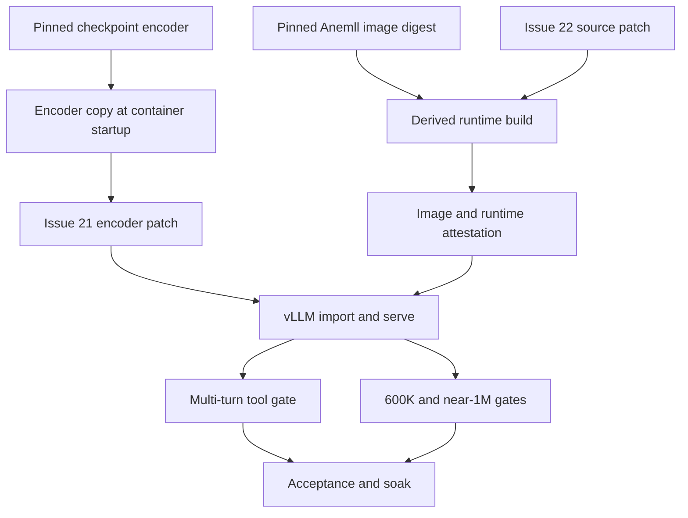
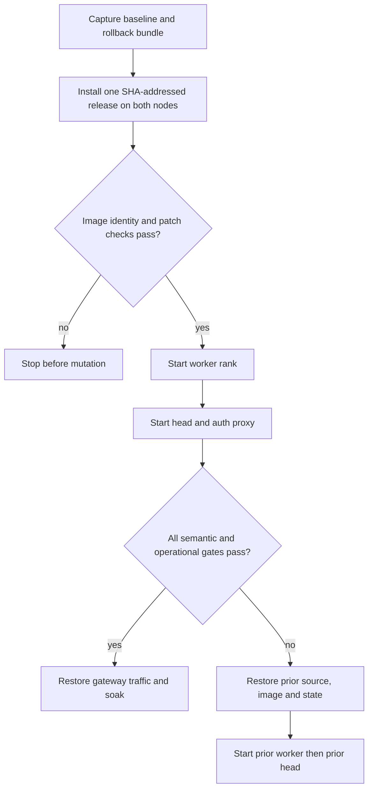

# DeepSeek Runtime Hotfixes - Plan

## Goal Capsule

- **Objective:** Integrate MiaAI Issues #21 and #22 into the hardened dual-DGX DeepSeek lane, reconcile the PR with current upstream, and deploy the result with reproducible artifacts and rollback proof.
- **Authority:** Preserve the accepted controls and thresholds in `docs/plans/2026-08-09-001-fix-deepseek-stack-health-plan.md` unless this plan names a narrower override.
- **Execution profile:** Reconcile upstream first, characterize the vulnerable paths, add failing proof, build one canonical derived runtime, verify locally, then perform one controlled worker-first rollout.
- **Stop conditions:** Stop before cutover if either patch is not present in both effective runtimes, image identity differs across ranks, the repository suite fails, rollback inputs are incomplete, or upstream reconciliation weakens an existing hardening gate.
- **Tail ownership:** This work owns commits on the existing PR branch, PR synchronization, dual-node rollout, acceptance evidence, and rollback when any live gate fails.

---

## Product Contract

### Summary

The hardened text-only 0731 lane will gain the upstream multi-turn tool-history and long-context decode fixes without enabling vision, abliterated weights, a larger KV allocation, or a new default reasoning level.

### Problem Frame

Both active ranks still contain the pre-Issue #21 encoder and pre-Issue #22 `nvfp4_ds_mla` dispatch. Tool history can therefore be corrupted after the first tool call, and decode at roughly 600K or more context can enter the slow BF16-cache path. The current PR is also conflicting with upstream main, while the worker checkout and controller checkout do not share one reproducible source revision.

### Requirements

**Runtime behavior**

- R1. `encode_arguments_to_dsml` must preserve equivalent DSML for JSON-string and dictionary tool arguments without wrapping a valid dictionary under an `arguments` parameter.
- R2. A live multi-turn conversation must replay one prior tool call and produce a valid second tool call through the authenticated DeepSeek origin.
- R3. `nvfp4_ds_mla` must dispatch to the optimized FP8-compatible kernel path while `fp8_ds_mla` and unsupported dtypes retain their intended paths.
- R4. Context at 600K or more must show a material decode improvement, while short-context behavior must not regress beyond the accepted performance envelope.

**Artifact and configuration integrity**

- R5. The official `deepseek-ai/DeepSeek-V4-Flash-0731` checkpoint revision, text-only profile, 12 GiB per-rank KV budget, MTP-5 profile, request-level reasoning modes, fail-closed origin, and current gateway controls must remain unchanged.
- R6. Issue #22 must be present in a derived image built from the pinned Anemll digest and attested by base reference, source commit, patch checksum, runtime file checksum, and image identity.
- R7. Issue #21 must run after the checkpoint encoder copy and before vLLM import on both ranks, because the copy replaces any encoder modification baked into the image.
- R8. Head and worker must use the same SHA-addressed release archive, compose inputs, transferred derived image identity, model manifest, and hotfix checksums before startup.

**Delivery and operations**

- R9. Reconciliation with upstream main must happen before hotfix implementation, preserve all files and behavior introduced by the hardening branch, and leave vision and abliterated paths disabled by default.
- R10. The full repository suite, patch-specific tests, compose validation, and shell syntax gates must pass before any live restart.
- R11. The rollout must preserve the existing worker-first startup, exact rollback bundle, PostgreSQL/LiteLLM state, existing Hermes credential, and external authentication boundary.
- R12. Acceptance must include patch attestation, multi-turn tools, short and long context, near-1M capacity, memory/PSI, both-rank participation, speculative acceptance, prefix-cache reuse, semantic readiness, Minefield, and a 30-minute soak.

### Acceptance Examples

- AE1. Given identical tool arguments represented once as JSON text and once as a dictionary, when the patched encoder renders them, then the DSML parameter sequence is identical and contains no synthetic `arguments` parameter.
- AE2. Given a completed first tool call and tool result in history, when the model receives a follow-up request, then it emits a valid second tool call with the requested function name and parseable arguments.
- AE3. Given `nvfp4_ds_mla`, when the runtime is inspected before vLLM starts, then the optimized cache-path condition includes both `fp8_ds_mla` and `nvfp4_ds_mla`.
- AE4. Given a matched 600K-or-greater prompt before and after cutover, when decode is measured, then the patched lane reaches at least 10 tok/s and at least five times the vulnerable baseline without OOM or restart.
- AE5. Given the completed rollout, when both nodes are inspected, then source revision, image identity, model revision, patch checksums, runtime checksums, and rendered serve arguments match.
- AE6. Given any failed live gate, when rollback executes, then the previous known-good DeepSeek lane returns worker-first and the existing direct-origin and LiteLLM credentials authenticate successfully.

### Scope Boundaries

- Keep vision disabled and do not deploy the VL sidecar or MCP plugin.
- Keep official 0731 weights and do not stage or serve the abliterated checkpoint.
- Keep `DEFAULT_THINKING=low` for operations; do not inherit upstream's `max` default.
- Keep the explicit 12 GiB KV budget; capacity-ladder experiments remain separate work.
- Do not replace the hardened branch with upstream main or delete its private-smoke, gateway, evidence, and test assets.

#### Deferred to Follow-Up Work

- Controlled 13/14/15 GiB per-rank KV capacity ladder.
- Vision sidecar evaluation on separate capacity.
- Abliterated checkpoint evaluation under a different served-model identity.
- Formal extraction of durable learnings into `docs/solutions/` after this rollout lands.

---

## Planning Contract

### Key Technical Decisions

- KTD1. **Merge current upstream while resolving conflicts in favor of hardened contracts.** Port the two fixes as first-class branch behavior and accept only upstream changes that do not weaken R5-R12. (session-settled: user-approved — chosen over replacing the branch with upstream main: the existing hardening has already passed near-1M and soak acceptance.)
- KTD2. **Bake Issue #22 into a derived image.** Build from the pinned digest and fail the build when the vulnerable source anchor or patched condition cannot be verified. (session-settled: user-approved — chosen over mutating running containers after startup: image-level identity makes both ranks reproducible and rollback attributable.)
- KTD3. **Apply Issue #21 after encoder installation.** Bake the versioned patcher into the derived image and execute that immutable copy in the compose startup command immediately after the checkpoint encoder copy. (session-settled: user-approved — chosen over patching the encoder itself only at image build: the runtime copy would overwrite that encoder fix.)
- KTD4. **Make every hotfix fail closed.** Missing files, unknown source anchors, checksum divergence, patch verification failure, and rank mismatch stop startup or rollout. This tightens upstream scripts that currently warn or continue after an unsuccessful patch.
- KTD5. **Prove behavior at the real boundaries.** Unit tests prove source transformation, compose tests prove installation order, live tool replay proves multi-turn semantics, and matched long-context probes prove kernel-path impact.
- KTD6. **Keep one PR branch and one live cutover.** Reconcile `upstream/main` on `codex/dual-dgx-deepseek-hermes-smoke`, push reviewed commits to PR #23, and deploy only the exact pushed revision.

### High-Level Technical Design

### Assumptions

- Both Sparks remain reachable through the existing host-local SSH configuration and retain the current base image and model cache.
- The head is the canonical builder. It exports one exact derived image for loading on the worker; independent per-node builds are not accepted as identity proof.
- The existing rollback tooling remains the authority for service and LiteLLM state restoration.
- The user authorization to plan and execute includes one bounded production restart after all preflight gates pass.
- Upstream vision files may remain in the reconciled repository, but their flags and defaults must keep them inactive.

### System-Wide Impact

- **Agents:** Multi-turn tool history becomes stable across JSON-string and dictionary argument representations.
- **Performance:** Long-context NVFP4 decode uses the correct optimized path; short-context and MTP behavior remain under the prior gates.
- **Supply chain:** The runtime becomes a derived local artifact with explicit provenance instead of an unmodified upstream digest.
- **Operations:** Both nodes converge on one source and image identity; rollback restores the former pinned image and exact state.
- **Contribution:** PR #23 becomes current with upstream while retaining a reviewable separation between upstream compatibility and Plexiz hardening.

### Risks and Mitigations

- Upstream reconciliation touches configuration and lifecycle files already changed by the hardening branch. Resolve conflicts against R5-R12 and run the entire suite after the merge.
- A local image tag can point to different bytes on each node. Build once, transfer that image, and compare immutable image identity and runtime file checksums, not tags.
- A build context or checkout sync can leak ignored secrets. Produce release and build inputs from an allowlisted manifest of versioned files, reject `.env*`, `.secrets`, keys, and raw evidence, and validate the manifest before Docker or SSH receives it.
- An image receipt can attest only to values it generated itself. Anchor provenance in a versioned manifest that fixes the base digest, upstream hotfix commits, Dockerfile hash, and patch hashes, then recompute them independently during acceptance.
- The checkpoint encoder copy can silently undo Issue #21. Assert startup ordering and inspect the effective installed encoder on both ranks.
- Long-context probes can monopolize the lane. Run them before restoring gateway traffic, keep semantic liveness separate, and never restart solely because a bounded canary reports busy/degraded.
- A pre-patch 600K baseline may be too slow. Bound it, retain partial timing evidence, and reject the cutover if the post-patch threshold cannot be established.

---

## Implementation Units

### U1. Add fail-closed runtime patch artifacts

- **Goal:** Package Issue #22 in a derived runtime and Issue #21 as a post-copy startup patch with reproducible provenance.
- **Requirements:** R1, R3, R6-R8; AE1, AE3; KTD2-KTD4.
- **Dependencies:** U4.
- **Files:** `recipe/Dockerfile.anemll-runtime-hotfixes`, `recipe/runtime-hotfixes.manifest.json`, `patches/hotfix-nvfp4-ds-mla-issue22.py`, `patches/hotfix-encoding-dsv4-issue21.py`, `build-anemll-runtime-hotfixes.sh`, `scripts/verify-runtime-hotfixes.py`, `tests/test_runtime_hotfixes.py`, `.env.dspark.example`.
- **Approach:** Add idempotent source transformations with strict source anchors. Bake Issue #22 during image construction and install the Issue #21 patcher into the same immutable image for post-copy execution. Build from an allowlisted temporary context and a versioned provenance manifest; record labels and a machine-readable receipt whose values are independently recomputed during verification.
- **Execution note:** Start with tests that demonstrate the vulnerable source transformations and fail when either patch is missing or already differs unexpectedly.
- **Patterns to follow:** Manifest hashing in `scripts/verify-artifact-manifest.py`, immutable pin validation in `validate-dspark-config.sh`, and the existing patch documentation in `docs/PATCHES.md`.
- **Test scenarios:**
  - The Issue #22 transform changes only the vulnerable condition and is idempotent.
  - An unknown or partially changed Issue #22 source fails instead of warning.
  - Issue #21 produces identical DSML for string and dictionary arguments and remains idempotent.
  - An unknown Issue #21 source fails instead of silently skipping.
  - The derived-image definition uses the pinned base digest and records both patch checksums.
  - The build context rejects ignored environment, secret, key, and raw-evidence files.
  - The provenance verifier rejects self-consistent receipts that do not match the reviewed manifest.
  - The verifier rejects mismatched base, image identity, runtime checksum, source revision, or patch checksum.
- **Verification:** Patch-specific tests pass and an inspected derived image proves the optimized condition before any service rollout.

### U2. Integrate patches into the dual-rank lifecycle

- **Goal:** Make startup, validation, and worker synchronization use the exact derived image and post-copy encoder fix on both ranks.
- **Requirements:** R5-R8, R10; AE3, AE5; KTD2-KTD4.
- **Dependencies:** U1.
- **Files:** `docker-compose.dspark.yml`, `start-deepseek-v4-flash-dspark.sh`, `validate-dspark-config.sh`, `scripts/generate-node-env.py`, `tests/test_artifact_contract.py`, `tests/test_lifecycle_contract.py`, `tests/test_deploy_gate.py`.
- **Approach:** Run the patcher baked into the derived image after encoder copy and before vLLM import. Project the derived image identity and provenance inputs through the existing allowlisted head/worker environment. Transfer the canonical head-built image and one SHA-addressed, allowlisted release archive to the worker before compose validation. Fail preflight on missing image-baked patchers, ordering errors, archive/image mismatch, or rank divergence.
- **Execution note:** Prove rendered startup ordering and head/worker parity before invoking Docker on either node.
- **Patterns to follow:** Worker env allowlisting, worker-first lifecycle, compose rendering, and cleanup-on-failure contracts already covered by the listed tests.
- **Test scenarios:**
  - Compose runs encoder copy, Issue #21, runtime verification, then vLLM in that order.
  - Head and worker render the same immutable derived image identity and hotfix paths.
  - Missing patch files or a base-image tag without digest fail validation.
  - Existing memory, scheduler, reasoning, auth, and restart-policy assertions remain unchanged.
- **Verification:** Offline lifecycle and artifact tests prove both ranks will start from the same verified inputs without a post-start mutation or extra restart.

### U3. Add behavioral regression gates

- **Goal:** Detect Issue #21 through real multi-turn history and Issue #22 through matched short- and long-context observations.
- **Requirements:** R1-R4, R10, R12; AE1-AE4; KTD5.
- **Dependencies:** U1-U2.
- **Files:** `scripts/smoke-openai-compat.py`, `scripts/probe-full-context.py`, `scripts/benchmark-scheduler.py`, `tests/test_lifecycle_contract.py`, `tests/test_deploy_gate.py`, `deployments/private-smoke/fixtures/suite.json`, `deployments/private-smoke/run-acceptance.sh`, `deployments/private-smoke/schemas/acceptance.schema.json`.
- **Approach:** Extend semantic smoke with a synthetic first tool call, synthetic tool response, replayed assistant tool call, and required second tool selection. Store only outcomes, counts, and hashes; scan logs and evidence for tool-argument/result canaries. Add a streaming 600K-or-greater probe that separates TTFT from decode throughput over at least 64 post-first-token intervals, while retaining the existing near-1M capacity and scheduler gates.
- **Execution note:** Observe the pre-patch multi-turn or source-level failure and record the vulnerable long-context baseline before promoting the patched runtime.
- **Patterns to follow:** Existing reasoning-history render probes, structured tool smoke, full-context gate evaluation, scheduler baseline provenance, and acceptance schema versioning.
- **Test scenarios:**
  - Covers AE2. The live second tool call succeeds after replaying dictionary arguments from the first assistant tool call.
  - String and dictionary representations remain semantically equivalent through `/tokenize` or the closest effective render boundary.
  - Malformed tool arguments remain classified without corrupting subsequent history.
  - Covers AE4. Matched 600K-or-greater decode uses identical prompt bytes, output limit, reasoning mode, temperature, and repeated trials; it meets both the absolute and relative thresholds over at least 64 post-first-token intervals.
  - Short-context decode stays within 10% of the accepted baseline and near-1M retains existing memory, PSI, and restart thresholds.
- **Verification:** Unit tests prove classifiers and payload construction; live acceptance proves both bugs are absent at their real boundaries.

### U4. Reconcile upstream before implementation and update PR #23

- **Goal:** Remove the PR conflict while preserving the hardening branch and excluding experimental runtime changes from production defaults.
- **Requirements:** R5, R9-R10; KTD1, KTD6.
- **Dependencies:** None.
- **Files:** `.env.dspark.example`, `.gitignore`, `CHANGELOG.md`, `README.md`, `docker-compose.dspark.yml`, `docs/DEEPSEEK_V4_FLASH_0731.md`, `docs/ENVS.md`, `prepare-dspark-model-cache.sh`, `start-deepseek-v4-flash-dspark.sh`, `stop-deepseek-v4-flash-dspark.sh`, `validate-dspark-config.sh`, plus upstream-added files retained behind disabled flags.
- **Approach:** Merge current `upstream/main` into the existing branch before U1. Resolve overlapping files against the requirements in this plan and the earlier hardening plan. Keep upstream Issue #21/#22 attribution and documentation while replacing permissive runtime hotpatch behavior with the fail-closed derived-image contract in later units.
- **Execution note:** Re-run all repository tests immediately after conflict resolution to establish the implementation base, then inspect the final diff against current upstream again after U1-U3.
- **Patterns to follow:** Existing merge commit at the branch tip, current PR scope, and immutable artifact contracts.
- **Test scenarios:**
  - The merge leaves no conflict markers and PR #23 is mergeable against current main.
  - Vision and abliterated flags remain disabled by default.
  - The default reasoning level and 12 GiB KV profile remain unchanged.
  - Private-smoke, rollback, gateway, Hermes, evidence, Minefield, and hardening tests remain present.
- **Verification:** The full suite passes on the reconciled tree and GitHub reports the pushed PR branch as current and non-conflicting.

### U5. Deploy, verify, and retain rollback evidence

- **Goal:** Move both Sparks to the exact pushed revision and accept or roll back the new runtime using the full operational contract.
- **Requirements:** R4-R8, R11-R12; AE2-AE6; KTD5-KTD6.
- **Dependencies:** U4, then U1-U3.
- **Files:** `deployments/private-smoke/run-acceptance.sh`, `deployments/private-smoke/scripts/collect-node-evidence.sh`, `deployments/private-smoke/scripts/sanitize-evidence.py`, `deployments/private-smoke/schemas/acceptance.schema.json`, `docs/runbooks/private-dual-spark-smoke.md`, `CHANGELOG.md`.
- **Approach:** Capture the current revision, image, manifests, keys, database snapshot, service state, performance baseline, and a SHA-addressed prior release archive. Build and attest the derived image once on the head, export it, load that exact artifact on the worker, and install one allowlisted SHA-addressed source release on both nodes. Validate rollback inputs offline before the single worker-first cutover; invoke rollback only on a failed live gate. Run patch/runtime, semantic, performance, gateway, Minefield, soak, and host gates, then retain only sanitized evidence without prompt, reasoning, tool-argument, or tool-result bodies.
- **Execution note:** Do not restore external gateway traffic until the direct-origin tool and long-context gates pass. Treat busy/degraded separately from unavailable.
- **Patterns to follow:** The rollback bundle, acceptance report, secret-redaction, and worker-first runbook established by the prior hardening plan.
- **Test scenarios:**
  - Covers AE5. Both nodes attest the same source, image identity, model manifest, and runtime checksums.
  - Covers AE2 and AE4. Multi-turn tools and long-context decode meet their gates before gateway restoration.
  - Near-1M, scheduler, memory/PSI, prefix cache, MTP acceptance, both-rank, Minefield, and 30-minute soak gates pass with zero OOM/restarts.
  - The existing Hermes key succeeds directly and through LiteLLM, while unauthenticated external access remains rejected.
  - Covers AE6. Offline rollback verification proves the prior release archive, image, manifests, scripts, keys, and database dump are complete; an actual restore is executed only if a live gate fails, after which semantic readiness is confirmed with the existing credential.
- **Verification:** The final acceptance artifact is true, both containers remain stable, the gateway is authenticated, and the rollback receipt is complete and sanitized.

---

## Verification Contract

| Gate | Applies to | Required evidence |
|---|---|---|
| Patch-specific unit tests | U1-U3 | Vulnerable fixtures fail before transformation; patched string/dict DSML and NVFP4 dispatch pass; unknown anchors fail closed. |
| `python3 -m unittest discover -s tests -v` | U1-U4 | Every repository contract test passes after upstream reconciliation. |
| Shell syntax and compose rendering | U2-U5 | Changed shell entrypoints parse and both rank configs render the same pinned artifacts and unchanged hardening profile. |
| Derived-image attestation | U1-U2, U5 | Versioned provenance values, base digest, source revision, patch checksums, transferred image identity, and effective runtime checksums match independently on both nodes. |
| Direct authenticated semantic smoke | U3, U5 | Reasoning modes, history preservation, multi-turn tools, stream, strict fields, cap classification, and semantic readiness pass. |
| Matched performance probes | U3, U5 | Short context stays within 10% of baseline; a repeated streaming 600K-or-greater trial computes decode over at least 64 post-first-token intervals and reaches at least 10 tok/s and 5x vulnerable baseline; near-1M retains prior capacity and host thresholds. |
| Private LiteLLM and Hermes smoke | U5 | Existing key works, unauthenticated access fails, and supported behavior matches the direct origin. |
| Pinned Model Serving Minefield | U5 | The existing pin runs with the same secret-handling contract and records exact problem, inconclusive, and unimplemented counts. |
| 30-minute soak and host observation | U5 | Zero errors, OOMs, restarts, or PSI pressure; both ranks participate; prefix-cache and MTP acceptance remain within the prior accepted envelope. |
| PR synchronization | U4 | Pushed branch equals the deployed revision and GitHub reports no merge conflict with current main. |

---

## Definition of Done

- U1-U5 are implemented in dependency order with focused verification evidence and canonical commits.
- PR #23 contains current upstream main plus the preserved hardening and the two fail-closed hotfix contracts.
- Both Sparks run the exact pushed revision, identical derived image identity, pinned official model revision, and unchanged production profile.
- Issues #21 and #22 are proven fixed through behavioral and runtime evidence, not source inspection alone.
- The full repository suite, direct-origin smoke, gateway smoke, Minefield, long-context gates, and 30-minute soak pass.
- Rollback is rehearsed and the prior known-good DeepSeek lane can be restored with the existing credentials.
- Evidence is sanitized, no secrets or prompt/reasoning bodies enter committed artifacts, and abandoned experimental code is absent from the final diff.

---

## Sources and Research

- `docs/plans/2026-08-09-001-fix-deepseek-stack-health-plan.md` defines the accepted hardening and operational thresholds.
- `docs/PATCHES.md` and `docs/DEEPSEEK_V4_FLASH_0731.md` define existing patch, tokenizer, and long-context patterns.
- MiaAI Issue #21: `https://github.com/MiaAI-Lab/DeepSeek-v4-Flash-DSpark-2x-DGX-Spark/issues/21`.
- MiaAI Issue #22 and commit `6c42a7a36f0a42b5f0c2ad3a1f517de75dbc675f`: `https://github.com/MiaAI-Lab/DeepSeek-v4-Flash-DSpark-2x-DGX-Spark/issues/22`.
- Model Serving Minefield remains pinned by the prior plan at commit `2b453b8a69dbaf8dc9d521dc2d6212cdaceb8169`.
